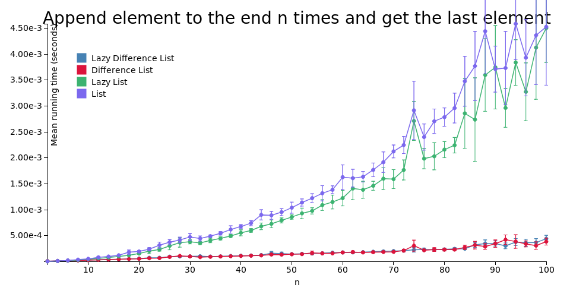

# purescript-difference-containers

"Difference containers" is a name of this implementation of [difference lists](https://wiki.haskell.org/Difference_list). This library is usable with both `Data.List` and `Data.List.Lazy` (and potentially can be used with any list-like structure with `mempty` value and `append` operation).

# Explanation

Suppose there is a container type `cnt :: * -> *` with associative operation `append :: ∀ a. cnt a -> cnt a -> cnt a`, the time complexity of which is dependent on the first argument's size and is constant for any size of the second.

Then, a structure of form `append (append a b) c` is equivalent to the one of form `append a (append b c)`, but the latter requires less computations, because the size of `a` plus the size of `b` is generally less than the size of `a` plus the size of `append a b`.

This observation can be utilized for performance optimisation. It is possible to delay a computation that intensively appends to the right, and "rebalance the parentheses" before computing the final value.

See also: [R. John Muir Hughes, *A novel representation of lists and its application to the function ``reverse''*](https://www.cs.tufts.edu/%7Enr/cs257/archive/john-hughes/lists.pdf).

# About this implementation

- Instead of providing two types for strict and lazy difference lists, this library defines the `Difference` type, which is parametrised by the inner container type. `Difference List` is thus equivalent to [`DList` in Haskell](http://hackage.haskell.org/package/dlist).

- For convenience, instances of `Functor`, `Apply`, `Bind`, `Monad`, `Foldable`, `Unfoldable` and `Traversable` type classes are provided for `Difference cnt` type if `cnt` is also an instance of the corresponding type class. However, their methods convert `Difference cnt` to `cnt` under the hood, so the benefits of employing this library may be defeated by their use.

- To avoid stack safety issues, [purescript-stacksafe-function](https://github.com/safareli/purescript-stacksafe-function/) is used. It allows accumulating large number of functions using `compose` without hitting the stack size limit when actually running the resulting function.

# Benchmarks

# Documentation

Module documentation is published on [Pursuit](https://pursuit.purescript.org/packages/purescript-difference-containers/).
