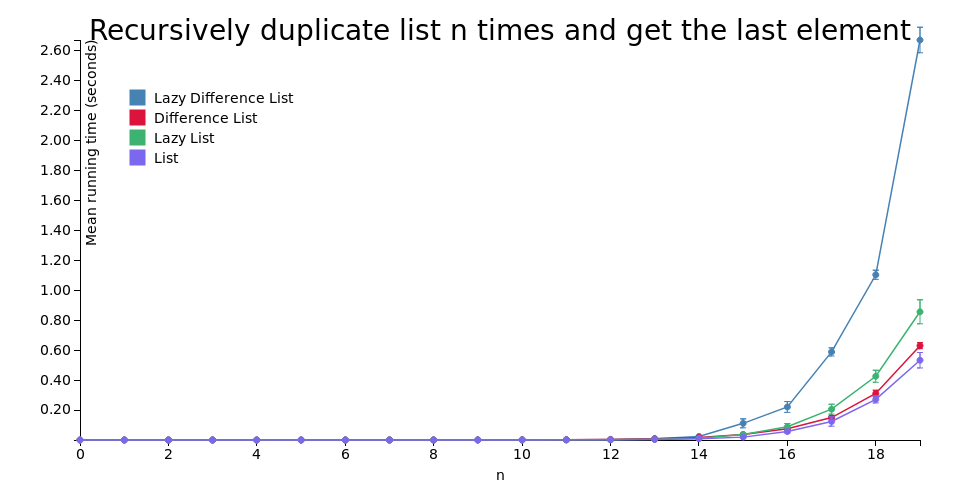

# purescript-difference-containers

Difference containers are a generalization of [difference lists](https://wiki.haskell.org/Difference_list) for any `Monoid`.

# Explanation

Suppose we have some container type `cnt :: * -> *` with associative operation `append :: ∀ a. cnt a -> cnt a -> cnt a`, the time complexity of which is dependent on the first argument's size and is constant for any size of the second.

Then, a structure of form `append (append a b) c` is equivalent to the one of form `append a (append b c)`, but the latter requires less computations, because the size of `a` plus the size of `b` is generally less than the size of `a` plus the size of `append a b`.

This observation can be utilized for performance optimisation. It is possible to delay a computation that intensively appends to the right, and "rebalance the parentheses" before computing the final value.

# About this implementation

- Instead of providing two types for strict and lazy difference lists, this library defines the `Difference` type, which is parametrised by the inner container type.

- Since in purescript we don't have the luxury of stack-safe function composition, difference container is a newtype wrapper over an `Array` of partially applied `append` functions, which can be stack-safely `foldr`'ed.

- For convenience, instances of `Functor`, `Apply`, `Bind` and `Monad` type classes are provided for `Difference cnt` type if `cnt` is also an instance of the corresponding type class. However, their methods flatten the internal `Array`, so the benefits of employing this library may be defeated by their use.

# Benchmarks

# Notes

- See also: [Difference lists in Haskell](http://hackage.haskell.org/package/dlist).

- There may exist useful applications of difference containers other than amortization of linked list's `append`. They are still to be found.

# Documentation

Module documentation is published on [Pursuit](https://pursuit.purescript.org/packages/purescript-difference-containers/).